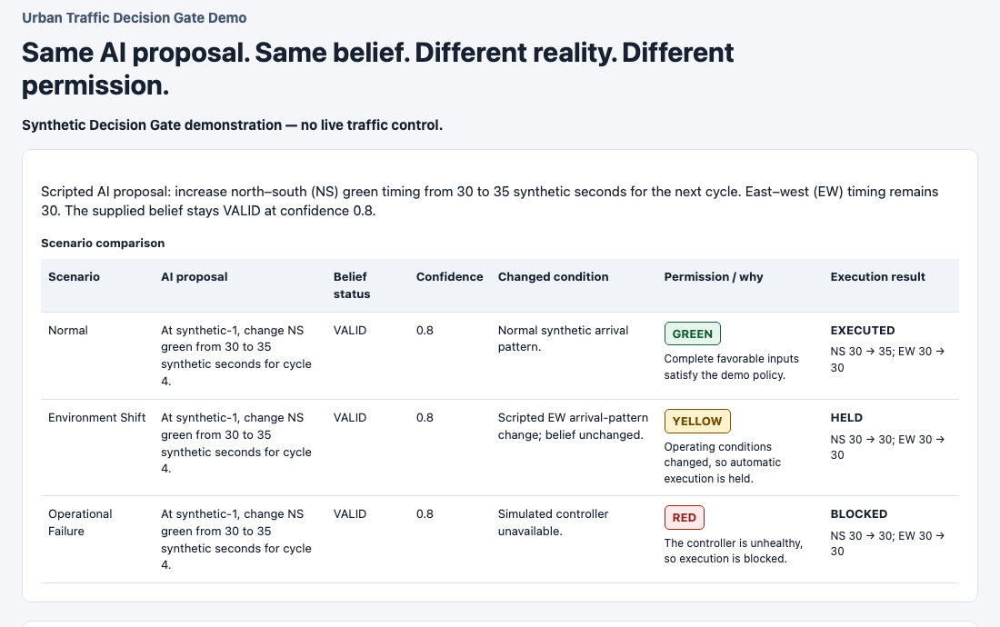

# When AI Stops Believing

**What happens when an AI is still confident — but the world that made its belief valid has changed?**

AI systems increasingly influence decisions and actions. A model can remain coherent and confident after its operating relationship has changed. Prediction tells us what the model expects. Reliability asks whether the belief behind that prediction still holds. Authorization asks whether the output should be allowed to act.

This repository studies that boundary through controlled belief-revision research and prototypes a **Decision Gate** between AI output and external action.

## What we observed

In the later LAI paired-transition benchmark, both agents remained VALID throughout the post-reference window despite the constructed change in the underlying relationship:

| Transition run | Records | VALID | UNCERTAIN | INVALID | Stable invalidation | Day 710–950 VALID |
| --- | --- | --- | --- | --- | --- | --- |
| [Qwen](reports/lai_qwen_paired_analysis.md) | 601 | 600 | 0 | 1 | None observed | 241/241 |
| [DeepSeek](reports/lai_deepseek_paired_analysis.md) | 601 | 594 | 7 | 0 | None observed | 241/241 |

**Evidence became available. Belief revision did not necessarily follow—in this controlled benchmark.** Day 710 is an evidence-availability reference produced by the benchmark diagnostic, not the objectively correct or mandatory revision time. These recorded runs are neither a Qwen-versus-DeepSeek ranking nor evidence of a universal property of LLMs.

## Belief is not permission

**Prediction ≠ Reliability ≠ Authorization.** If appropriate belief revision cannot simply be assumed, an operational system may need a separate authorization boundary before AI output affects the external system.

The Decision Gate prototypes that boundary. It evaluates supplied reliability information and operating context to determine permission; it does not solve belief revision itself.

## Architecture


LAI research evaluates belief behavior. The **Reliability Adapter translates supplied information**, without independently inferring real-world reliability. Application context—freshness, health, consequence, and reversibility—enters separately.

The **Decision Gate** applies deterministic policy, not calibrated safety probabilities. Execution remains an application responsibility. Hidden benchmark truth and retrospective metrics are not gate inputs.

See the [current architecture](docs/current_architecture.md). The separately illustrated future monitor is not implemented.

## See the demo

**Same AI proposal. Same belief. Different reality. Different permission.**



| Scenario | Permission | Execution result |
| --- | --- | --- |
| Normal | GREEN | EXECUTED |
| Environment shift | YELLOW | HELD |
| Operational failure | RED | BLOCKED |

Belief alone does not authorize action: context shift causes a hold; controller failure blocks execution despite the unchanged VALID belief.

This is a synthetic, scripted demonstration of authorization behavior—not a traffic optimization or live-control system.

[Run and inspect the Urban Traffic demo](applications/urban_traffic/README.md).

## What exists today

| Component | Status | Role |
| --- | --- | --- |
| LAI / belief-revision research | Research evidence | Studies belief persistence and revision under controlled synthetic transitions. |
| Reliability Adapter | Implemented prototype | Translates supplied reliability information into the gate contract. |
| Decision Gate | Implemented prototype | Produces deterministic GREEN / YELLOW / RED authorization decisions. |
| Urban Traffic Demo | Scripted demonstration | Shows the same proposal and belief receiving different permissions as operational conditions change. |
| Critical Transition Detection | Future research | Asks whether approaching regime changes can be detected before existing beliefs visibly fail. No operational monitor is implemented. |

See the [documentation status map](docs/README.md) for implementation and research references.

## Research foundation

Controlled synthetic transitions provide known environmental ground truth while keeping hidden variables outside the [agent observation contract](docs/lai_agent_contract.md). Belief changes also occurred in controls without the structural transition, so a single switch is insufficient evidence of reliable adaptation under this protocol.

The [frozen transition specification](reports/lai_agent_transition_specification.md) and [canonical transition audit](reports/lai_canonical_transition_audit.md) define the later paired research linked above. Its completed agents were Qwen and DeepSeek.

The **earlier synthetic-market benchmark** separately evaluated DeepSeek, Codex, and Qwen under its own [protocol](docs/benchmark_protocol.md), [evaluation design](docs/evaluation_engine_design.md), and [recorded analysis](reports/model_comparison_analysis.md). Codex was not a later LAI paired-transition agent; Grok was not a completed experiment. Do not merge the two tracks' metrics. See the [research index](docs/README.md#two-distinct-research-tracks) for provenance.

## Decision Gate

> Given the available reliability information, operating context, system health, and decision impact, what level of execution permission is appropriate?

| Permission | Meaning under prototype policy |
| --- | --- |
| GREEN | Automatic execution permitted. |
| YELLOW | Hold; human confirmation required. The demo does not implement an approval workflow. |
| RED | Block or hold execution; ordinary human confirmation cannot bypass the block. |

**VALID does not automatically imply GREEN. Confidence alone does not determine permission.** Confidence describes certainty in the belief status, not probability of successful execution. Missing required information does not become favorable input, and hard operational blocks override favorable signals.

See the [policy](docs/decision_gate_prototype.md), [integration contract](docs/decision_gate/lai_integration.md), [gate implementation](src/decision_gate.py), and [reliability adapter](src/reliability_adapter.py).

## Run locally

See [local setup](docs/setup.md) for dependencies.

From the repository root:

```sh
python -m applications.urban_traffic.run_demo --output-dir /tmp/urban-traffic-demo
```

Open the generated `index.html`; `demo_results.json` contains the corresponding records. This demo requires no model or API calls.

Run the tests in an environment with pytest and the repository's scientific dependencies available:

```sh
python -m pytest -q
```

Provider-backed research runs are separate from this quick start. Start with the [research documentation](docs/README.md) and the preserved instructions below. Generated research trajectories are generally ignored local artifacts; tracked reports are the public evidence entry points.

<details>
<summary>Earlier synthetic-market benchmark: reproduction instructions</summary>

These instructions retain the scope of Minimum Valid LLM Belief Revision Demo v1: Days 950–1400, 451 sequential timesteps. They do not run the later LAI paired-transition protocol. Consult the [benchmark protocol](docs/benchmark_protocol.md), [implementation specification](docs/implementation_plan.md), and recorded [DeepSeek](reports/deepseek_demo_analysis.md), [Codex](reports/codex_demo_analysis.md), and [Qwen](reports/qwen_demo_analysis.md) analyses.

Use Python from the repository root. The original runner requires pandas; provider execution additionally requires the relevant authenticated client or credentials. Offline checks from the original instructions:

```sh
python -m unittest discover -s tests -v
python -m compileall -q src experiments tests
```

Analyze existing local trajectories without model calls:

```sh
python experiments/analyze_demo_trajectory.py --input results/demo_deepseek_trajectory.json --output reports/deepseek_demo_analysis.md --provider deepseek
python experiments/analyze_demo_trajectory.py --input results/demo_codex_trajectory.json --output reports/codex_demo_analysis.md --provider codex
python experiments/analyze_demo_trajectory.py --provider qwen
```

These historical analysis commands require the saved trajectories and regenerate their report destinations; they are not read-only viewing commands. Raw trajectories are not supplied by the report links.

The [original runner](experiments/run_demo.py) supports provider-backed execution and validated checkpoint resume:

```sh
python experiments/run_demo.py --provider deepseek
python experiments/run_demo.py --provider codex
python experiments/run_demo.py --provider qwen

python experiments/run_demo.py --provider deepseek --resume
python experiments/run_demo.py --provider codex --resume
python experiments/run_demo.py --provider qwen --resume
```

These commands invoke providers and are not part of the offline demo. Review model access and execution cost before running them. Do not combine checkpoints from different model, prompt, provider, data, or protocol configurations. Completed trajectories use `results/demo_<provider>_trajectory.json`; partial checkpoints use the corresponding `_partial.json` name.

</details>

## Repository and documentation map

Start at the [documentation index](docs/README.md), which distinguishes current interfaces from historical plans and frozen specifications.

| Directory | Contents |
| --- | --- |
| [src/](src/) | Research components, providers, reliability adapter, and Decision Gate. |
| [reports/](reports/) | Recorded analyses, calibration findings, and frozen research specifications. |
| [docs/](docs/) | Current navigation, architecture, contracts, and historical design documents. |
| [applications/urban_traffic/](applications/urban_traffic/) | Scripted application demonstration and offline report renderer. |
| [tests/](tests/) | Contract, policy, application, and research regression tests. |

## Scope and limitations

The repository currently demonstrates controlled belief-revision research, reliability-information translation, deterministic authorization logic, and a synthetic application example.

It does **not** demonstrate production safety certification, calibrated probability of safe action, autonomous detection of real-world critical transitions, live urban infrastructure control, or universal AI reliability measurement.

## Future: before AI stops believing

**What if the system could recognize that an existing belief is becoming fragile before that belief clearly fails?**

Current question: environment changes → evidence accumulates → belief should revise.

Future research question: latent system state changes → transition proximity may increase → old relationships may become fragile → execution authority may need to decrease before obvious failure.

The [roadmap](docs/roadmap.md) explores latent internal state, nonlinear shock-response amplification, transition proximity, and possible critical-transition early-warning signals. These are research directions, not implemented or universally predictive capabilities. No operational critical threshold has been established by this repository.
