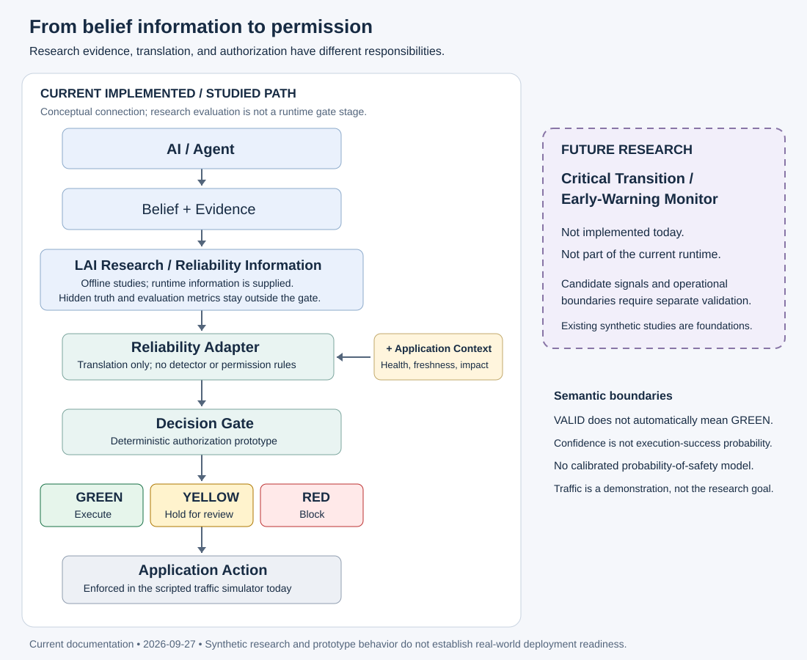

# Current repository architecture

As of 2026-09-27, the repository combines bounded synthetic research, a reliability
translation interface, a deterministic authorization prototype, and an offline
application demonstration. See the [status map](README.md) for evidence links.

## Research and observation side

AI belief and observable evidence → LAI research/evaluation → supplied reliability information

This is a conceptual relationship, not an automatic pipeline from benchmark
scores into runtime authorization. The [AgentBelief schema](../src/lai_agent_schema.py)
represents status, confidence, explanation, and supporting/contradicting evidence.
The [causal contract](lai_agent_contract.md) restricts what an agent may observe.
[Belief metrics](../src/lai_belief_metrics.py) and the
[paired evaluator](../src/lai_paired_evaluator.py) analyze research trajectories.
Hidden ground truth and retrospective reference times belong to research
evaluation; they are not runtime gate inputs.

The [system-layer report](../reports/lai_system_experiment_a.md) studies a specified
synthetic mechanism. The recorded [Qwen](../reports/lai_qwen_paired_analysis.md) and
[DeepSeek](../reports/lai_deepseek_paired_analysis.md) paired analyses describe
behavior under their frozen conditions. These observations must not be described
as universal model behavior, general intelligence rankings, or validation of a
real-world reliability detector. The earlier synthetic-market benchmark is a
separate track, as explained in the [index](README.md).

## Operational side

Reliability Adapter + application-specific context → Decision Gate →
GREEN / YELLOW / RED → application execution boundary

1. The [Reliability Adapter](../src/reliability_adapter.py) copies supplied belief
   information into a `ReliabilityObservation`, then builds a `DecisionRequest`
   with explicit application context. It does not decide permissions or infer
   conflict from evidence text. Missing information remains `None`.
2. The application supplies action identity, operational conditions, consequence,
   reversibility, and any additional explicit reliability signals. Evidence lists
   and provenance stay in the observation because the current request has no
   corresponding fields. See the [integration contract](decision_gate/lai_integration.md).
3. The [Decision Gate](../src/decision_gate.py) validates the request and applies
   [versioned deterministic rules](decision_gate_prototype.md). It returns reasons,
   action scope, policy version, and structured assessment alongside permission.
4. Execution enforcement belongs to the application. The existing
   [traffic simulator](../applications/urban_traffic/simulator.py) applies GREEN
   actions, holds YELLOW, and blocks RED. It checks action scope before mutation
   and prevents repeated execution of an action ID within its state instance.

The adapter is not an independently validated real-world reliability detector.
The gate is not a calibrated probability-of-safety model. Confidence describes
certainty in a belief status, not probability of successful execution. VALID does
not automatically imply GREEN: context change, impact, missing information, or
operational failure can restrict permission. Hard blocking conditions override
review conditions. Ordinary human confirmation cannot bypass RED; no approval
workflow is implemented in the demo.

## Application boundary today

The [Urban Traffic demo](../applications/urban_traffic/README.md) uses three
scripted fixtures with identical beliefs and different contexts. It demonstrates
GREEN/EXECUTED, YELLOW/HELD, and RED/BLOCKED. It changes a synthetic timing
configuration; it does not optimize traffic or infer new reliability information.
Traffic is an application demonstration, not the core project or a real-city
validation. The [tests](../tests/test_urban_traffic_demo.py) exercise enforcement
and state isolation; [gate tests](../tests/test_decision_gate.py) and
[adapter tests](../tests/test_reliability_adapter.py) cover the shared contracts.

General production execution integrations, authorization expiry, authenticated
human approval, and persistent audit infrastructure are not implemented by these
prototypes. Returned decisions are snapshots, not tamper-proof execution tokens.
The [future early-warning monitor](roadmap.md) is a separate research direction
and is not part of the current runtime.
